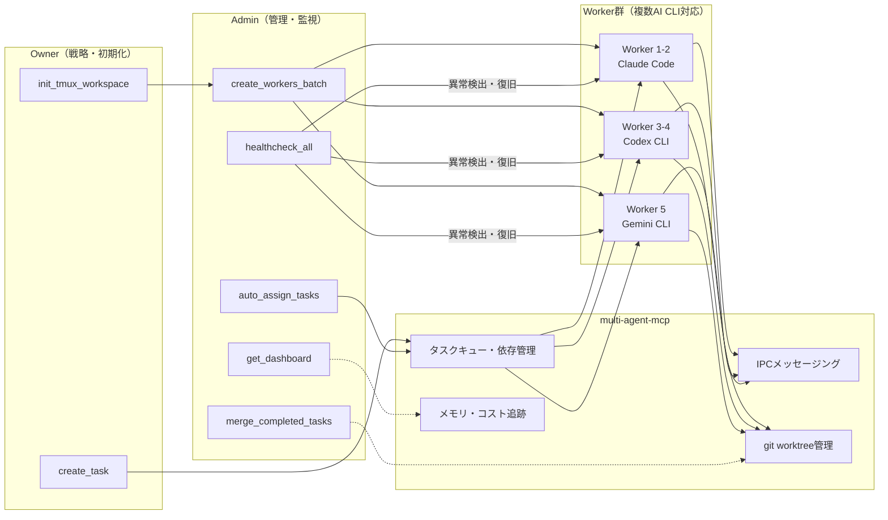
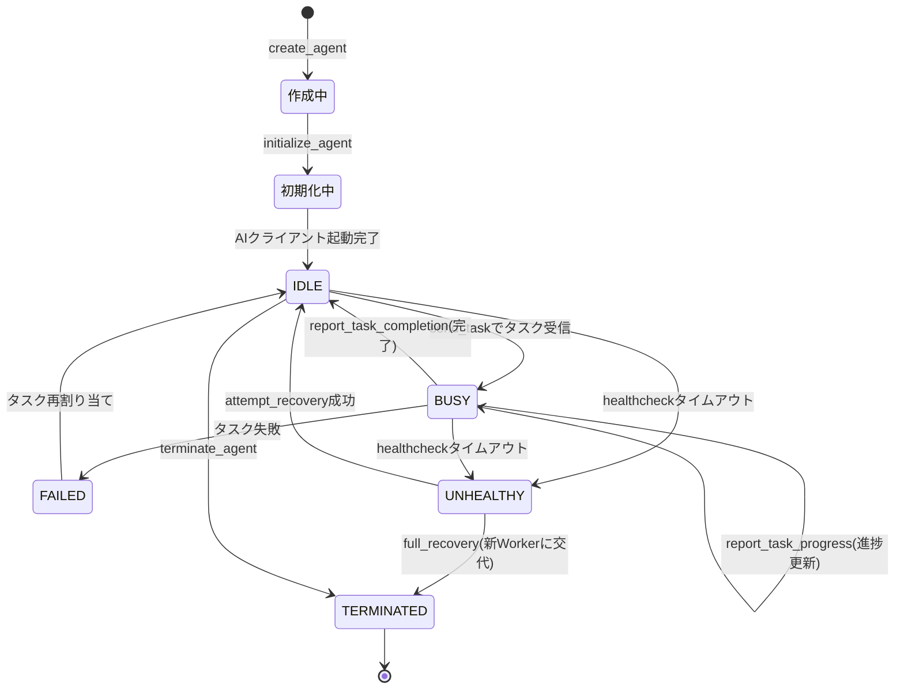
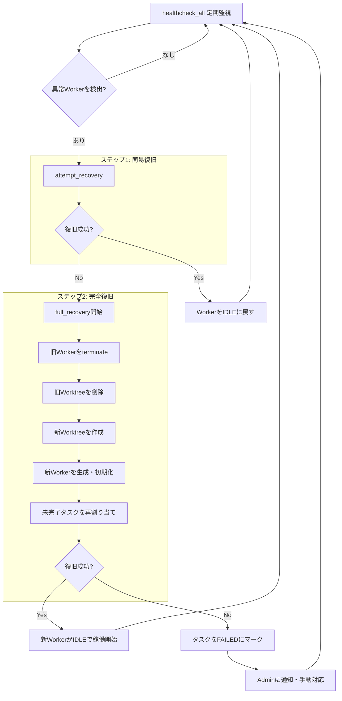

## はじめに

最近、AIエージェントを並列で動かして実装を進める「マルチエージェント開発」がかなり現実的になってきました。

私も以下の先行記事・実装を参考にしつつ、MCPサーバーと実運用フローを自作しました。

- [Claude Code × MCPで複数AIエージェントを作って並列開発する](https://zenn.dev/shio_shoppaize/articles/5fee11d03a11a1)
- [MCPサーバーを作って、Claude Codeでマルチエージェントの並列開発を実現する（v1.1.0）](https://zenn.dev/shio_shoppaize/articles/8870bbf7c14c22)
- [Codex CLIでMCPマルチエージェント並列開発を実現する](https://zenn.dev/shio_shoppaize/articles/dc85db324bb3f0)
- [yohey-w/multi-agent-shogun](https://github.com/yohey-w/multi-agent-shogun)

今回の記事では、次の2点を中心にまとめます。

1. 自作した `multi-agent-mcp` と `multi-flow / multi-issue-flow` の構成
2. 参考実装にはない追加機能（差分）の調査結果

## この記事の前提

### 参考実装側

`multi-agent-shogun` のREADMEでは、最小構成のMCPツールセット（Worker作成、タスク送信、状態確認、出力確認など）で並列開発を回す思想が示されています。まず「動くマルチエージェント」の基礎を作るには非常にわかりやすい構成です。

### 今回の実装側

今回作った実装は次の3つです。

- MCP本体: [`shiiman/multi-agent-mcp`](https://github.com/shiiman/multi-agent-mcp)
- Claude向けWorkflow: [`shiiman/claude-code-plugins`](https://github.com/shiiman/claude-code-plugins) の `multi-flow` / `multi-issue-flow`
- Codex向けWorkflow: [`shiiman/dotfiles`](https://github.com/shiiman/dotfiles) の同名グローバルスキル

狙いは「試作レベルを超えて、日常開発で壊れにくく回せる運用基盤」にすることでした。

## なぜ自作MCPを作ったのか

自作に踏み切った動機は大きく2つあります。

1. **MCPサーバーを自分で作ったことがなかった** — 技術的な興味として「MCPの仕組みを理解するなら自分で実装するのが一番早い」と考えた
2. **参考実装にはない機能が実運用で必要だった** — shogunの思想はそのまま活かしつつ、日常開発で壊れにくい基盤に仕上げたかった

以下、それぞれ掘り下げます。

### shogunの良さ: シンプルで始めやすい

まず前提として、`multi-agent-shogun` は非常によくできた実装です。

- **最小構成のMCPツールセット** でマルチエージェントの基礎が動く
- Worker作成・タスク送信・状態確認・出力確認といった核心の操作が揃っている
- 「まず動かしてみる」ための学習コストが低い

実際、私もこの実装を読んで「マルチエージェント並列開発の動かし方」を理解できました。概念実証（PoC）としての完成度は高く、マルチエージェントに入門するなら今でも最初に触る価値があると思います。

### 限界が見えた3つの場面

一方、実際に日常の開発業務で回してみると、shogunの「シンプルさ」が制約になる場面が出てきました。

#### 1. Workerが落ちたとき、手動対応が必要になる

shogunはWorkerの正常系に集中した設計です。セッションが固まる・応答が途絶えるといった異常時の検知と復旧は手動で行う必要があります。

小さなPoCなら再起動すれば済みますが、5〜10タスクを並列で回しているときに1つ止まると、依存タスクまで巻き込んで全体が遅延します。**運用中に「止まらない仕組み」が欲しくなった**のが最初のきっかけでした。

#### 2. タスクの依存関係や優先度が管理できない

shogunの設計は「タスクを送ってWorkerが実行する」というフラットな構造です。しかし実開発では「タスクAが終わらないとBに着手できない」「このタスクは先に片付けたい」といった制御が頻繁に発生します。

依存関係をフロー側で手動管理するのは煩雑で、MCPサーバー側にキュー・依存・優先度の仕組みが必要だと判断しました。

#### 3. Claude Code以外のAI CLIが使えない

これが最も大きな理由です。shogunはClaude Code向けに最適化されており、他のAI CLI（Codex CLIなど）をWorkerとして混在させる設計にはなっていません。

しかし実運用では、**タスクの性質によって最適なモデルが異なる**ことを繰り返し実感しました。設計寄りの議論はClaude、既存コードの大量修正はCodexといった使い分けを、同一のオーケストレーション基盤で行いたかったのです。

### 「フォーク」ではなく「自作」を選んだ理由

shogunをフォークして拡張する選択肢も検討しましたが、以下の判断で新規実装にしました。

1. **設計思想の違い**: shogunは「最小構成で動かす」、自作は「運用で壊れにくくする」という方向性の違いがあり、フォークだとコアの設計を大幅に書き換えることになる
2. **ロールモデルの差**: `owner / admin / worker` の3層構造は、shogunの1層構造とは根本的に異なるため、上乗せするよりゼロから設計したほうが整合性を保てる
3. **複数AI CLI対応**: Workerの起動・通信・状態管理をAI CLIごとに抽象化する必要があり、既存の内部構造の上に載せるよりも新しく作るほうが自然だった

結果として、shogunの思想（MCPでマルチエージェントを回す）は継承しつつ、実装は目的に合わせてゼロから書く判断をしました。

### 複数AI CLI対応がなぜ重要か

自作の最大の動機である「複数AI CLI対応」について、もう少し掘り下げます。

マルチエージェント開発では、複数のWorkerが同時にタスクをこなします。このとき**全Workerを同じモデルで動かす必然性はありません**。

| 観点 | 単一CLI固定 | 複数CLI対応 |
|---|---|---|
| タスク適性 | モデルの得意/不得意に関わらず同一 | タスクごとに最適なモデルを選択可能 |
| 障害耐性 | 1社の障害で全停止 | 別CLIに切り替えて継続可能 |
| コスト最適化 | 一律の料金体系 | タスク難易度に応じて安価なモデルを選択可能 |
| 将来拡張性 | 新モデル対応にフロー全体の改修が必要 | Worker起動部分の追加で対応可能 |

特に「障害耐性」は見落とされがちですが、APIの rate limit やサービス障害でWorkerが止まったとき、別のAI CLIに切り替えて作業を続行できるのは実運用では大きなメリットです。

この設計があるからこそ、後述するWorkflow（`multi-flow` / `multi-issue-flow`）もClaude・Codex両対応で動作できています。

## 参考にはない機能を調査して整理

比較しやすいように、差分を機能カテゴリごとにまとめます。

| 機能カテゴリ | 参考実装（基礎） | 今回の追加実装 | 実運用での価値 |
|---|---|---|---|
| ロール分離 | Worker中心 | `owner / admin / worker` の3層ロール + 権限チェック | 操作責務を分離し、誤操作を減らせる |
| タスク運用 | 単純なタスク送信 | タスク作成・キュー投入・依存関係・優先度 | 大きめタスクを分割して管理しやすい |
| 自動割り当て | 手動寄り | 空きWorkerへの自動割り当て、バッチ作成 | 並列化の立ち上げコストを削減 |
| 障害復旧 | 基本操作中心 | ヘルスチェック、`attempt_recovery`、`full_recovery` | セッション異常時の復旧が速い |
| Git連携 | 最小限 | `git worktree` 管理、`gtr` 連携、完了タスクのマージ補助 | ブランチ衝突を減らしつつ並列実装 |
| 可観測性 | 状態確認 | ダッシュボード、進捗報告、未読管理、tmux出力取得 | 現在地が把握しやすくレビューしやすい |
| ナレッジ管理 | なし/限定的 | メモリ保存・検索、グローバルメモリ、アーカイブ | ノウハウ再利用で2回目以降が速い |
| コスト/モデル管理 | なし/限定的 | コスト集計、警告閾値、`standard/performance` 切替 | 速度とコストの両立を調整しやすい |
| CI前後フロー | 実装中心 | `multi-flow`（軽量）/`multi-issue-flow`（Issue〜PR） | プロジェクト規模に応じて運用を選べる |

### 補足: 追加実装のポイント

#### 運用の堅牢化

MCP側に「監視・復旧・権限」を持たせたことで、単に並列で速いだけでなく、止まりにくい運用に寄せられました。

#### 開発フローの2モード化

`multi-flow` は「Issueなしでサッと並列実装」、`multi-issue-flow` は「Issue起点でPRまで完走」と使い分けできます。

#### チーム向けの管理機能

メモリ/アーカイブ/コスト管理は、個人開発よりチーム開発で効いてきます。とくに「誰が何をやったか」と「次回再利用できる知見」が残るのが大きいです。

## 実装の工夫点

表で整理した各機能カテゴリについて、設計判断の背景や実装上の工夫を掘り下げます。

### ロール分離: owner / admin / worker の3層構造

単に「親と子」の2層ではなく、**owner（統括）・admin（管理）・worker（実行）の3層**にしたのが最初の大きな判断でした。

```text
Owner  → Issue作成、MCP初期化、最終確認（最初と最後だけ）
Admin  → タスク分配、Worker管理、ダッシュボード更新（運用の中核）
Worker → 割り当てられたタスクの実装実行（コードに専念）
```

すべてのMCPツール呼び出しで権限チェックが走る仕組みにしており、122個のツール×3ロールの権限を`TOOL_PERMISSIONS`辞書で一元管理しています。Workerが誤ってワークスペース全体を初期化してしまう、といった事故を構造的に防げます。

権限エラー時には「許可されたロール」と「役割ガイドの取得方法」を自動提示するようにしており、エージェントが自力で正しい操作に辿り着ける設計です。

### タスク運用: 優先度付きキューと依存関係

タスク管理には**優先度付きヒープキュー**（`heapq`）を採用しました。

```text
優先度レベル: CRITICAL(0) > HIGH(1) > MEDIUM(2) > LOW(3)
同一優先度の場合は作成日時順で処理
```

ポイントは、キュー（次の実行タスク取得用）とマップ（O(1)参照用）の**二重索引**構造です。「次に何を実行するか」と「特定タスクの優先度更新」の両方を効率的に処理できます。

依存関係は**遅延評価**方式で、実行直前に毎回チェックします。事前に全依存を解決してからキューに入れるのではなく、動的に完了状況を確認するため、途中でタスクの完了順が変わっても柔軟に対応できます。

### 自動割り当て: グリッドレイアウトとバッチ作成

Workerの配置はtmuxの**グリッドレイアウト**で自動管理しています。

```text
メインウィンドウ: Admin(pane 0) + Worker×6(pane 1-6)
追加ウィンドウ:   2×5グリッド = 10ペイン/ウィンドウ
最大16 Workerまで対応
```

`create_workers_batch`で複数Workerを一括作成でき、各WorkerにAI CLI・モデル設定を個別に適用できます。終了済み（TERMINATED）のWorkerはスロット検索から自動的に除外されるため、障害復旧後の再割り当てもスムーズです。

### 障害復旧: 二段階ハング検出と段階的回復

運用で最も苦労したのが**「本当にハングしているかの判定」**です。単にタイムスタンプが古いだけでは、長時間の処理中なのか本当に止まっているのか区別できません。

そこで**二段階検出**を実装しました。

```text
ステップ1: last_activityから一定時間無応答をチェック（10分）
ステップ2: tmuxペイン出力のハッシュを比較
  → ハッシュ変化なし = 確実にハング
  → ハッシュ変化あり = 処理中（タイマーリセット）
```

回復も段階的です。

- **attempt_recovery**: エージェント内でAI CLIをリセット（軽量な復旧）
- **full_recovery**: エージェントごと交換（worktree削除→再作成→タスク再割り当て）

`full_recovery`ではworktreeの再作成が失敗する場合があるため、UUIDサフィックスを付与してリトライする仕組みも入れています。復旧試行は最大3回に制限し、無限ループを防止しています。

### Git連携: gtr自動フォールバックとworktree無効モード

**gtr（git-worktree-runner）があれば使い、なければ通常のgit worktreeにフォールバック**する設計です。環境に応じて自動判定するため、gtrをインストールしなくても基本動作に問題はありません。

さらに`MCP_ENABLE_WORKTREE=false`でworktree自体を無効化できるモードも用意しました。小規模プロジェクトや既存のブランチ運用と干渉させたくない場合に使えます。

### 可観測性: ダッシュボードとポーリング制御

ダッシュボードは**YAML Front Matter + Markdown形式**で管理しています。

```yaml
---
workspace_id: "session-123"
tasks:
  - id: "task-1"
    title: "実装タスク"
    status: "in_progress"
    progress: 50
---
```

人間が読める形式を意識しつつ、メタデータと本文を分離しています。複数MCPインスタンス（Owner、Admin、Worker）が独立プロセスで動作するため、in-memoryキャッシュではなく**ファイルベース**にし、`tempfile + os.replace`でアトミック書き込みを実現しました。

工夫したのは**Adminの過度なポーリング防止**です。IPC（プロセス間通信）の通知待機中はダッシュボードポーリングを制限し、ヘルスチェック直後や未読メッセージがある場合のみ許可するようにしています。

### ナレッジ管理: 3層メモリとアーカイブ

メモリは**3層構造**で設計しました。

```text
Layer 1: エージェント内メモリ（一時的、セッション中のみ）
Layer 2: グローバルメモリ（~/.multi-agent-mcp/memory/、全プロジェクト共有）
Layer 3: プロジェクトメモリ（セッション単位、プロジェクト固有）
```

各エントリは`YYYY-MM-DD_key.md`として個別ファイル保存されます。TTL（デフォルト90日）を超えたエントリは削除ではなく**アーカイブへ移動**し、復元可能にしています。「消してしまったが後で必要になった」というケースを防ぐ設計です。

グローバルメモリにより、プロジェクトAで得た知見をプロジェクトBでも活用できるのが実運用で大きな価値を生んでいます。

### コスト/モデル管理: プロファイル切り替え

**standard / performanceの2プロファイル**を用意し、全エージェントに一括適用できるようにしました。

```text
Standard:    Admin=Opus,   Worker=Sonnet, 最大6 Worker
Performance: Admin=Opus,   Worker=Opus,   最大16 Worker
```

コスト集計ではWorkerの実測コスト（API計測）と未実行タスクの推定値を併用し、警告閾値を超えた場合にアラートを出します。速度とコストのバランスを運用中に調整できるのがポイントです。

### CI前後フロー: Phase分離と非同期制御

`multi-flow`と`multi-issue-flow`は**Phase分離**で設計しています。

```text
Phase 1 (Owner)   → Issue作成 → MCP初期化 → Admin起動 → 計画書送信
Phase 2-4 (MCP)   → Admin/Workerが自律実行
Phase 5 (Owner)   → 結果確認 → 統合 → クリーンアップ → PR作成
```

Owner（人間に近い役割）は最初と最後だけ関与し、中間フェーズはMCP側が自律的に回します。Phase間は**macOS通知**で完了を伝え、手動トリガーで次Phaseに移行するため、「放置していたら知らない間に壊れていた」を防げます。

ユーザー確認ポイントをPhase 1（計画書内容）とPhase 5（実装結果）に配置し、**自動化と人間の判断のバランス**を取っています。

## 特におすすめ: 複数種類のAIエージェント対応

今回の実装で個人的に一番推しているのが、利用するAI CLIを切り替えられる設計です。

- Claude系で強いタスク
- Codex系で強いタスク
- Gemini系で強いタスク

を、同じマルチエージェント基盤で扱えるようにしました。

### なぜ効くのか

#### 1. タスク適性に合わせてモデルを振り分けられる

設計議論・実装・調査で得意分野が異なるため、単一モデル固定より精度が上がるケースが多いです。

#### 2. ベンダーロックを弱められる

1社の仕様変更や障害があっても、運用自体を止めずに回しやすくなります。

#### 3. 将来の機能進化を取り込みやすい

新しいモデル・新しいクライアントが出ても、フロー全体の作り直しを避けやすいです。

## 実現方法の詳細

ここからは、`multi-agent-mcp` と `multi-flow` / `multi-issue-flow` が実際にどう動くかを、フロー図で解説します。

### multi-flow / multi-issue-flow の実行フロー

2つのフローの違いを並べて示します。

```mermaid
flowchart TD
    subgraph MF["multi-flow（軽量フロー）"]
        MF1[計画書を作成] --> MF2[タスク分解・ダッシュボード作成]
        MF2 --> MF3[Worker一括生成 + Worktree割り当て]
        MF3 --> MF4[各Workerが並列実装]
        MF4 --> MF5[完了タスクをmainへマージ]
        MF5 --> MF6[ワークスペースクリーンアップ]
    end

    subgraph MI["multi-issue-flow（管理型フロー）"]
        MI1[GitHub Issueを作成] --> MI2[Issueからタスク分解・計画書作成]
        MI2 --> MI3[Worker一括生成 + Worktree割り当て]
        MI3 --> MI4[各Workerが並列実装]
        MI4 --> MI5[完了タスクをmainへマージ]
        MI5 --> MI6[PR作成・Issue更新]
        MI6 --> MI7[ワークスペースクリーンアップ]
    end
```



- **multi-flow** はIssue/PRを経由せず、計画書からそのまま並列実装に入ります。小〜中規模の改修で「サッと回したい」場合に向いています。
- **multi-issue-flow** はIssue起点でPR作成まで一気通貫で進むため、変更の追跡性が高く、チーム開発やレビュー込みの運用に適しています。

### MCPツールの連携フロー

`multi-agent-mcp` が提供するツール群が、各ロール間でどう連携するかを示します。ポイントは、WorkerごとにAI CLIを切り替えられる設計です。



- **Owner** がワークスペース初期化とタスク作成を行い、Adminに引き渡す
- **Admin** がWorkerの生成・タスク自動割り当て・ヘルスチェック・マージを管理
- **Worker群** は各自のAI CLI（Claude / Codex / Gemini）で動作し、MCPを通じて統一的に管理される
- **multi-agent-mcp** がタスクキュー・IPC・worktree・メモリを一元管理するため、AI CLIの種類に依存しない

### Workerライフサイクル

1つのWorkerが生成されてからタスクを完了するまでの状態遷移です。



- Workerは `IDLE`（待機）と `BUSY`（実行中）を繰り返しながらタスクを消化します
- 一定時間応答がない場合は `UNHEALTHY` と判定され、自動復旧の対象になります
- `FAILED` 状態のタスクは、同じWorkerまたは別のWorkerに再割り当てが可能です

### 障害復旧フロー

セッション異常を検出してから復旧するまでの3段階のフローです。



- **ステップ1（簡易復旧）**: `attempt_recovery` でAI CLIのリセットを試みます。一時的なフリーズはこの段階で解消されます
- **ステップ2（完全復旧）**: 簡易復旧が失敗した場合、Workerとworktreeを丸ごと作り直し、未完了タスクを新Workerに引き継ぎます
- **ステップ3**: 完全復旧も失敗した場合のみ、タスクをFAILEDとしてマークしAdminに通知します。手動対応が必要になるのはこのケースだけです

## 実際の使い分けイメージ

### 軽量で回したい場合（Issueなし）

```bash
# 例: 小〜中規模改修を並列実装
multi-flow "この機能を3タスクに分割して並列実装"
```

### ガバナンス込みで回したい場合（Issue〜PR）

```bash
# 例: Issue起点で並列実装し、PRまで作成
multi-issue-flow "要件XをIssue作成からPR作成まで実行"
```

### MCP側の実行イメージ

```text
1. ownerがworkspace初期化
2. adminがタスク分解・worker割り当て
3. workerが並列実装と進捗報告
4. 異常時はhealthcheck -> recovery
5. 完了後にレビュー・統合・クリーンアップ
```

## 環境変数によるカスタマイズ

`multi-agent-mcp` は環境変数で細かく動作を調整できます。設定は以下の優先順位で解決されます。

```text
1. 環境変数（最優先）
2. .multi-agent-mcp/.env ファイル（プロジェクト別）
3. デフォルト値
```

`init_tmux_workspace` を実行すると `.multi-agent-mcp/.env` が自動生成され、設定可能な全変数がコメント付きで書き出されます。必要な箇所だけコメントを外して値を変更すればOKです。

以下、よく使う設定をカテゴリ別に紹介します。

### 基本設定

| 変数 | デフォルト | 説明 |
|------|-----------|------|
| `MCP_MAX_WORKERS` | 6 | Workerの最大数。マシンスペックに応じて調整 |
| `MCP_ENABLE_WORKTREE` | true | `false`にするとgit worktreeを使わずに動作 |
| `MCP_DEFAULT_TERMINAL` | auto | ターミナルアプリ（auto/ghostty/iterm2/terminal） |
| `MCP_MCP_DIR` | .multi-agent-mcp | MCP設定ディレクトリ名 |

`MCP_MAX_WORKERS` はマシンのCPU/メモリに合わせて調整するのがおすすめです。`MCP_ENABLE_WORKTREE=false` にすると、worktreeを使わない小規模プロジェクトでも利用できます。

### tmux設定

| 変数 | デフォルト | 説明 |
|------|-----------|------|
| `MCP_WINDOW_NAME_MAIN` | main | メインウィンドウ名（Admin + Worker 1-6） |
| `MCP_WINDOW_NAME_WORKER_PREFIX` | workers- | 追加Workerウィンドウ名のプレフィックス |
| `MCP_EXTRA_WORKER_ROWS` | 2 | 追加ウィンドウの行数 |
| `MCP_EXTRA_WORKER_COLS` | 5 | 追加ウィンドウの列数 |
| `MCP_WORKERS_PER_EXTRA_WINDOW` | 10 | 追加ウィンドウあたりのWorker数 |

### モデルプロファイル設定

`standard` と `performance` の2プロファイルを切り替えて使えます。

| 変数 | デフォルト | 説明 |
|------|-----------|------|
| `MCP_MODEL_PROFILE_ACTIVE` | standard | アクティブプロファイル（standard/performance） |

#### standardプロファイル（コスト重視）

| 変数 | デフォルト | 説明 |
|------|-----------|------|
| `MCP_MODEL_PROFILE_STANDARD_CLI` | claude | 使用するAI CLI |
| `MCP_MODEL_PROFILE_STANDARD_ADMIN_MODEL` | opus | Adminのモデル |
| `MCP_MODEL_PROFILE_STANDARD_WORKER_MODEL` | sonnet | Workerのモデル |
| `MCP_MODEL_PROFILE_STANDARD_MAX_WORKERS` | 6 | Worker上限 |
| `MCP_MODEL_PROFILE_STANDARD_ADMIN_THINKING_TOKENS` | 4000 | Admin思考トークン数 |
| `MCP_MODEL_PROFILE_STANDARD_WORKER_THINKING_TOKENS` | 4000 | Worker思考トークン数 |
| `MCP_MODEL_PROFILE_STANDARD_ADMIN_REASONING_EFFORT` | medium | Admin推論強度 |
| `MCP_MODEL_PROFILE_STANDARD_WORKER_REASONING_EFFORT` | medium | Worker推論強度 |

#### performanceプロファイル（速度重視）

| 変数 | デフォルト | 説明 |
|------|-----------|------|
| `MCP_MODEL_PROFILE_PERFORMANCE_CLI` | claude | 使用するAI CLI |
| `MCP_MODEL_PROFILE_PERFORMANCE_ADMIN_MODEL` | opus | Adminのモデル |
| `MCP_MODEL_PROFILE_PERFORMANCE_WORKER_MODEL` | opus | Workerのモデル |
| `MCP_MODEL_PROFILE_PERFORMANCE_MAX_WORKERS` | 16 | Worker上限 |
| `MCP_MODEL_PROFILE_PERFORMANCE_ADMIN_THINKING_TOKENS` | 30000 | Admin思考トークン数 |
| `MCP_MODEL_PROFILE_PERFORMANCE_WORKER_THINKING_TOKENS` | 4000 | Worker思考トークン数 |
| `MCP_MODEL_PROFILE_PERFORMANCE_ADMIN_REASONING_EFFORT` | high | Admin推論強度 |
| `MCP_MODEL_PROFILE_PERFORMANCE_WORKER_REASONING_EFFORT` | high | Worker推論強度 |

たとえば `MCP_MODEL_PROFILE_STANDARD_CLI=codex` に変更すれば、standardプロファイルでCodex CLIを使う構成に切り替えられます。

### CLI別デフォルトモデル設定

各AI CLIごとのデフォルトモデルを設定できます。Claude固有のモデル名（opus、sonnetなど）が非Claude CLIで指定された場合、ここで設定したモデルにフォールバックします。

| 変数 | デフォルト | 説明 |
|------|-----------|------|
| `MCP_CLI_DEFAULT_CLAUDE_ADMIN_MODEL` | opus | Claude CLIのAdminデフォルトモデル |
| `MCP_CLI_DEFAULT_CLAUDE_WORKER_MODEL` | sonnet | Claude CLIのWorkerデフォルトモデル |
| `MCP_CLI_DEFAULT_CODEX_ADMIN_MODEL` | gpt-5.3-codex | Codex CLIのAdminデフォルトモデル |
| `MCP_CLI_DEFAULT_CODEX_WORKER_MODEL` | gpt-5.3-codex | Codex CLIのWorkerデフォルトモデル |
| `MCP_CLI_DEFAULT_GEMINI_ADMIN_MODEL` | gemini-3-pro | Gemini CLIのAdminデフォルトモデル |
| `MCP_CLI_DEFAULT_GEMINI_WORKER_MODEL` | gemini-3-flash | Gemini CLIのWorkerデフォルトモデル |

### Worker個別設定（per-workerモード）

全Workerを同一設定にする `uniform` モードと、Worker単位で切り替える `per-worker` モードがあります。

| 変数 | デフォルト | 説明 |
|------|-----------|------|
| `MCP_WORKER_CLI_MODE` | uniform | CLI設定モード（uniform/per-worker） |
| `MCP_WORKER_CLI_1`〜`16` | （空） | per-workerモード時のWorker別CLI |
| `MCP_WORKER_MODEL_1`〜`16` | （空） | per-workerモード時のWorker別モデル（`MCP_WORKER_CLI_MODE=per-worker`時のみ有効） |

```text
# 例: Worker 1-2をClaude、Worker 3-4をCodexで動かす
MCP_WORKER_CLI_MODE=per-worker
MCP_WORKER_CLI_1=claude
MCP_WORKER_CLI_2=claude
MCP_WORKER_CLI_3=codex
MCP_WORKER_CLI_4=codex
```

この設定が「複数AI CLI対応」の核心です。タスクの性質に応じてWorkerごとにAI CLIを切り替えることで、最適なモデルで並列実行できます。

### ヘルスチェック・復旧設定

| 変数 | デフォルト | 説明 |
|------|-----------|------|
| `MCP_SEND_COOLDOWN_SECONDS` | 2.0 | tmuxへの連続送信時の最小待機秒数（全CLI共通） |
| `MCP_HEALTHCHECK_INTERVAL_SECONDS` | 60 | 監視ループの実行間隔（秒） |
| `MCP_HEALTHCHECK_STALL_TIMEOUT_SECONDS` | 600 | 無応答判定の閾値（秒） |
| `MCP_HEALTHCHECK_IN_PROGRESS_NO_IPC_TIMEOUT_SECONDS` | 120 | in_progressタスクの無通信判定閾値（秒） |
| `MCP_HEALTHCHECK_MAX_RECOVERY_ATTEMPTS` | 3 | 復旧試行の上限回数 |
| `MCP_HEALTHCHECK_IDLE_STOP_CONSECUTIVE` | 3 | 実作業なし連続検出でdaemonを自動停止する閾値 |

`MCP_HEALTHCHECK_STALL_TIMEOUT_SECONDS` を短くすると異常検出が早くなりますが、長時間処理を誤検出するリスクもあります。タスクの性質に合わせて調整してください。

### コスト管理設定

| 変数 | デフォルト | 説明 |
|------|-----------|------|
| `MCP_COST_WARNING_THRESHOLD_USD` | 10.0 | コスト警告の閾値（USD） |
| `MCP_ESTIMATED_TOKENS_PER_CALL` | 2000 | API呼び出しあたりの推定トークン数 |
| `MCP_MODEL_COST_TABLE_JSON` | `{"claude:opus":0.03,...}` | モデル別の1000トークン単価テーブル |
| `MCP_MODEL_COST_DEFAULT_PER_1K` | 0.01 | 未定義モデル向けの汎用単価（USD/1Kトークン） |

### メモリ管理設定

| 変数 | デフォルト | 説明 |
|------|-----------|------|
| `MCP_MEMORY_MAX_ENTRIES` | 1000 | メモリの最大エントリ数 |
| `MCP_MEMORY_TTL_DAYS` | 90 | メモリエントリの保持期間（日） |

### 品質チェック設定

| 変数 | デフォルト | 説明 |
|------|-----------|------|
| `MCP_QUALITY_CHECK_MAX_ITERATIONS` | 5 | 品質チェックの最大イテレーション回数 |
| `MCP_QUALITY_CHECK_SAME_ISSUE_LIMIT` | 3 | 同一問題の繰り返し上限（超えたらOwnerに相談） |
| `MCP_QUALITY_GATE_STRICT` | true | 品質ゲートの厳格モード（falseで緩和） |

### スクリーンショット設定

| 変数 | デフォルト | 説明 |
|------|-----------|------|
| `MCP_SCREENSHOT_EXTENSIONS` | [".png",".jpg",".jpeg",".gif",".webp"] | スクリーンショットとして認識する拡張子 |

全環境変数の一覧は [multi-agent-mcp README](https://github.com/shiiman/multi-agent-mcp#環境変数) を参照してください。

## 公式機能の進化と今後方針（2026-02-08時点）

ここは現時点の動向も重要なので、具体日付で整理します。

### Claude側

Claude Code公式ドキュメントでは、`/agents` コマンドでエージェント作成・管理を行い、`.claude/agents/` でプロジェクト固有エージェントを定義できる導線が提供されています。

- 公式: [Claude Code - Agent Teams](https://docs.anthropic.com/ja/docs/claude-code/sub-agents)

私の体感でも、公式機能のほうが安定する場面は増えています。今後は自作フローに公式のAgent Teamsをどう組み込むかが次のテーマです。

### Codex側

OpenAI公式の「Introducing the Codex app」は **2026年2月2日公開** で、複数エージェント実行・worktree・スキル活用を含む運用のしやすさが一段上がっています。

- 公式: [Introducing the Codex app](https://openai.com/ja-JP/index/introducing-the-codex-app/)

Codex側もUI/UX改善が続く前提で、MCPの価値は「バックエンドのオーケストレーション」に寄っていくと見ています。

## まとめ

参考実装を土台にしつつ、今回の実装では次の方向に広げました。

1. 並列実装の速度だけでなく、運用の堅牢性を強化
2. Issueあり/なしの2種類のWorkflowを用意
3. 複数AI CLI対応で将来の選択肢を確保

マルチエージェントは「一部の人の実験」から「日常開発の選択肢」に移りつつあります。
まずは小さい改修からでも、ぜひ並列開発を体験してみてください。

## 参考リンク

- [Claude Code × MCPで複数AIエージェントを作って並列開発する](https://zenn.dev/shio_shoppaize/articles/5fee11d03a11a1)
- [MCPサーバーを作って、Claude Codeでマルチエージェントの並列開発を実現する（v1.1.0）](https://zenn.dev/shio_shoppaize/articles/8870bbf7c14c22)
- [Codex CLIでMCPマルチエージェント並列開発を実現する](https://zenn.dev/shio_shoppaize/articles/dc85db324bb3f0)
- [yohey-w/multi-agent-shogun](https://github.com/yohey-w/multi-agent-shogun)
- [shiiman/multi-agent-mcp](https://github.com/shiiman/multi-agent-mcp)
- [shiiman/claude-code-plugins](https://github.com/shiiman/claude-code-plugins)
- [shiiman/dotfiles](https://github.com/shiiman/dotfiles)
- [Claude Code - Agent Teams](https://docs.anthropic.com/ja/docs/claude-code/sub-agents)
- [Introducing the Codex app](https://openai.com/ja-JP/index/introducing-the-codex-app/)
